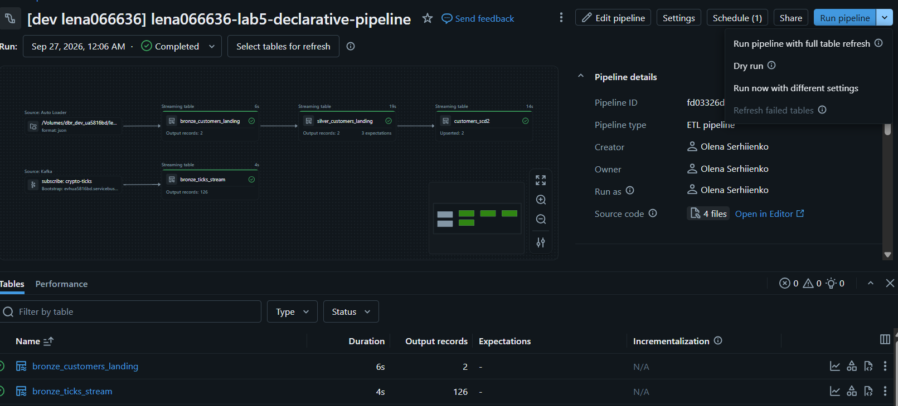

# Lab 5 — Declarative Pipelines / Lakeflow

## Overview

This project implements a Lakeflow Spark Declarative Pipeline (the successor to Delta Live
Tables) covering ingestion from both a streaming and a batch source, silver-layer data quality
enforcement, and an SCD Type 2 dimension, deployed through a Databricks Asset Bundle.

Catalog: `dbr_dev_ua5816bd`. Target schema: `lena066636_silver`. Bronze schema: `lena066636_bronze`.

## Architecture

```
Auto Loader (JSON, /Volumes/.../lena066636_bronze/...)  ─▶ bronze_customers_landing ─▶ silver_customers_landing ─▶ customers_scd2
Kafka (Event Hub, crypto-ticks)                         ─▶ bronze_ticks_stream
```

Two independent sources feed the pipeline. The streaming ticks table (`bronze_ticks_stream`)
demonstrates ingestion from a streaming source on its own. The CSV/JSON landing path
(`bronze_customers_landing`) flows through silver-layer cleaning and quality checks into a
Type 2 slowly changing dimension (`customers_scd2`).

## Components

**`pipelines/01_bronze_streaming.py`** — bronze table sourced from Event Hub over its
Kafka-compatible endpoint, reusing the same connection pattern as the crypto-demo project.

**`pipelines/02_bronze_landing.py`** — bronze table from a JSON landing volume, ingested via
Auto Loader. The landing path lives inside the bronze schema's own volume rather than a
separate landing schema.

**`pipelines/03_silver_expectations.py`** — cleans and deduplicates the landing records, with
three declared data-quality expectations: a non-null customer ID and city (enforced by dropping
violating rows), and a sanity check on population (flagged, not dropped).

**`pipelines/04_customers_scd2.py`** — a Type 2 slowly changing dimension built with
`apply_changes`, tracking both `city` and `population` so that a real attribute change is
visible across SCD2 versions.

**`notebooks/05_table_maintenance.py`** — runs `OPTIMIZE` and `VACUUM` on the silver tables,
executed as a separate job task after the pipeline completes.

**`resources/` + `databricks.yml`** — Databricks Asset Bundle definitions for the pipeline and
for a job that chains a pipeline run with the maintenance step.

## Results

The pipeline (`lena066636-lab5-declarative-pipeline`) completed successfully:

| Table | Type | Output records | Expectations |
|---|---|---|---|
| `bronze_customers_landing` | Streaming table | 2 | — |
| `bronze_ticks_stream` | Streaming table | 126 | — |
| `silver_customers_landing` | Streaming table | 2 | 3/3 passed |
| `customers_scd2` | Streaming table | 2 upserted | enforced upstream |



The wrapping job (`lena066636-lab5-pipeline-with-maintenance`) succeeded end to end in 1m 40s:
`run_pipeline` (42s) → `table_maintenance` (57s), on serverless compute.


Lineage for `customers_scd2`, checked in Catalog Explorer, correctly shows
`silver_customers_landing` as its upstream source, including the SCD2 tracking columns
(`__START_AT` / `__END_AT`) that `apply_changes` adds automatically.


Reload behavior was verified by attempting a full refresh on `customers_scd2`: it is blocked by
the framework's `pipelines.reset.allowed` protection on streaming tables, which prevents an
accidental full-refresh data loss. A normal incremental run (Start) processes correctly instead —
see `lineage_and_reload_notes.md` for details.

## Declarative vs classic comparison

A full write-up comparing this approach against the classic Spark jobs from Labs 3-4
(orchestration, data quality, idempotency, lineage, maintenance, flexibility, cost) is in
`comparison_declarative_vs_classic.md`.
