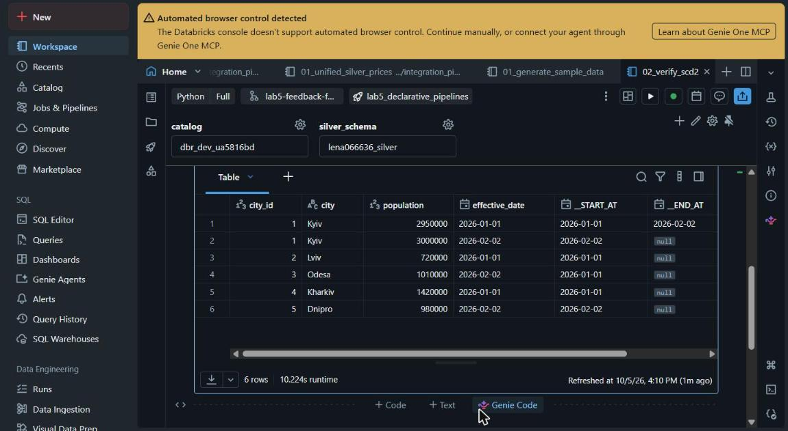
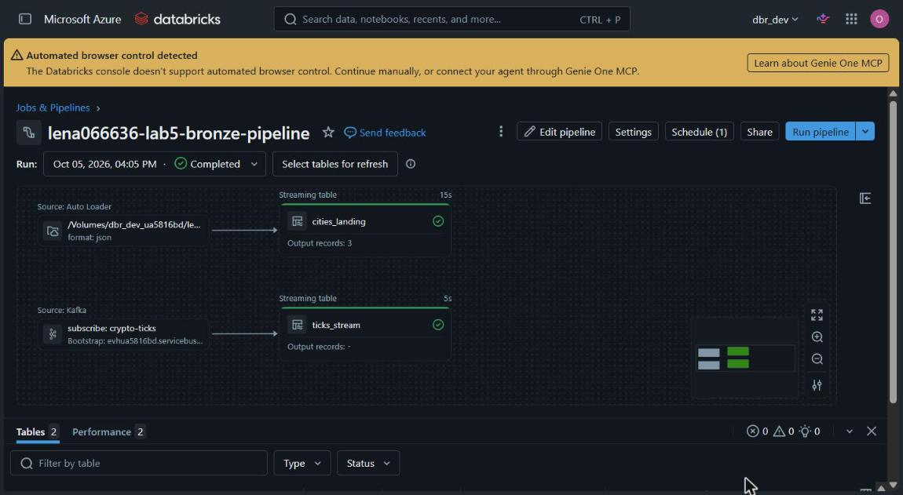
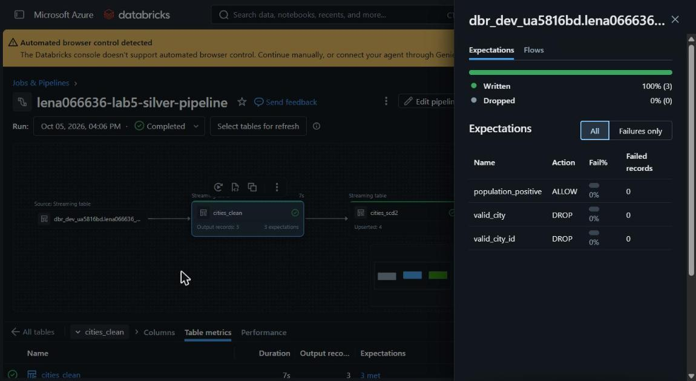
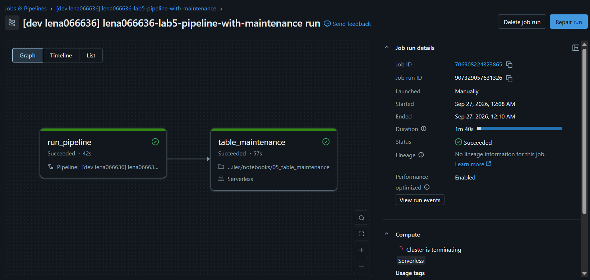
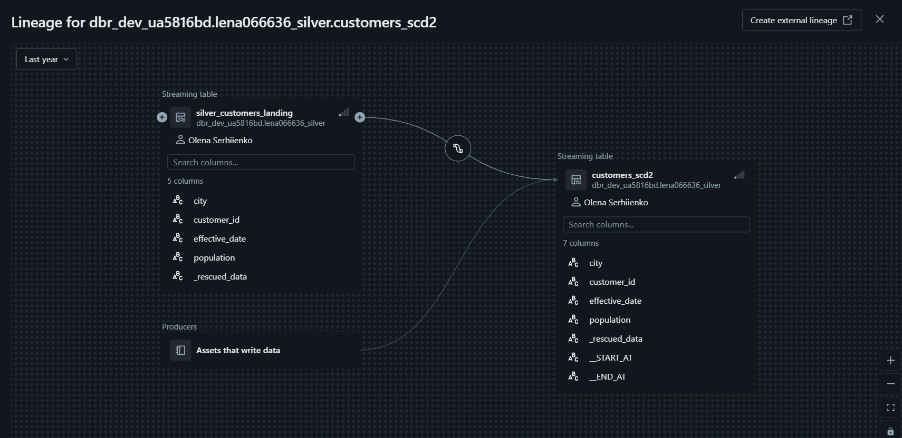

# Lab 5 — Declarative Pipelines / Lakeflow

## Overview

This project implements Lakeflow Spark Declarative Pipelines (the successor to Delta Live
Tables) for a dataset of cities. It covers ingestion from a streaming source and from a JSON
landing volume, silver-layer data quality enforcement, an SCD Type 2 dimension, and deployment
with a Databricks Asset Bundle.

Catalog: `dbr_dev_ua5816bd`. Bronze schema: `lena066636_bronze`. Silver schema: `lena066636_silver`.

## Architecture

```
Auto Loader (JSON, landing volume) ─▶ bronze.cities_landing ─▶ silver.cities_clean ─▶ silver.cities_scd2
Kafka (Event Hub, crypto-ticks)    ─▶ bronze.ticks_stream
```

A pipeline publishes its tables to a single schema. The bronze and silver layers live in
different schemas, so they are implemented as two pipelines orchestrated by one job:

```
Job: lena066636-lab5-bronze-silver-maintenance
  bronze_pipeline  ─▶  silver_pipeline  ─▶  table_maintenance
```

## Data model

The main entity is a city. Each record has `city_id`, `city`, `population` and
`effective_date`. The SCD Type 2 table `cities_scd2` keeps the history of changes of a city's
name or population, with `__START_AT` and `__END_AT` columns added by `apply_changes`
(`__END_AT` is null for the current version).

## Components

**`pipelines/bronze/01_bronze_streaming.py`**: table `ticks_stream`, sourced from Event Hub
over its Kafka-compatible endpoint.

**`pipelines/bronze/02_bronze_landing.py`**: table `cities_landing`, ingested from JSON files
in the landing volume with Auto Loader. Raw data only, no casting at this layer.

**`pipelines/silver/03_silver_cities.py`**: table `cities_clean`. Reads the bronze table,
applies types and trimming, and declares three data-quality expectations: non-null `city_id`
and `city` (violating rows are dropped) and a positive `population` (violations are reported).

**`pipelines/silver/04_cities_scd2.py`**: table `cities_scd2`, built with `apply_changes`.
A new version is created when the city name or population changes. `effective_date` is the
sequence column and is excluded from change tracking, so a repeated record with unchanged
values does not create a new version.

**`notebooks/03_table_maintenance.py`**: `OPTIMIZE` and `VACUUM` on the bronze and silver
tables, run as the last task of the job.

**`notebooks/01_generate_sample_data.py`** and **`notebooks/02_verify_scd2.py`**: dev/test
notebooks, not part of the job. The first writes a sample batch of city records into the
landing volume, the second shows the SCD2 history. The same batches are available as plain
files in `sample_data/`.

**`resources/` and `databricks.yml`**: Asset Bundle definitions for both pipelines and the job.
All parameters (catalog, schemas, paths, Event Hub settings) are passed as configuration, with
no values hardcoded in the pipeline code.

## SCD Type 2 verification

SCD2 behavior is verified with two input files. The first batch (`cities_batch_1.json`) loads
four cities. The second batch (`cities_batch_2.json`), loaded after the first run, contains:

| City | Change in batch 2 | Expected result in `cities_scd2` |
|---|---|---|
| Kyiv | population changed | previous version closed (`__END_AT` set), new current version added |
| Odesa | no change | still one version |
| Dnipro | new city | one new current version |
| Lviv, Kharkiv | not in batch 2 | unchanged, one version each |



## Results

Bronze pipeline run:



Silver pipeline run, with the data-quality expectations:



Job run with all three tasks:



Lineage of `cities_scd2`, checked in Catalog Explorer:



Reload behavior: a full refresh of `cities_scd2` is blocked by the framework's
`pipelines.reset.allowed` protection on streaming tables, which prevents accidental loss of
history. A normal incremental run processes new files correctly. If a full rebuild is really
needed, the table should be dropped explicitly and recreated by the pipeline.

## Declarative vs classic comparison

Compared with the classic Spark jobs from Labs 3-4, the declarative pipeline builds the
execution order and lineage from table dependencies automatically. Data-quality checks are
declared as expectations and reported in the pipeline UI. SCD2 is handled by `apply_changes`
instead of a hand-written MERGE. Table maintenance (OPTIMIZE, VACUUM) still runs as a separate
job task. The trade-off is less direct control over custom per-row logic.
